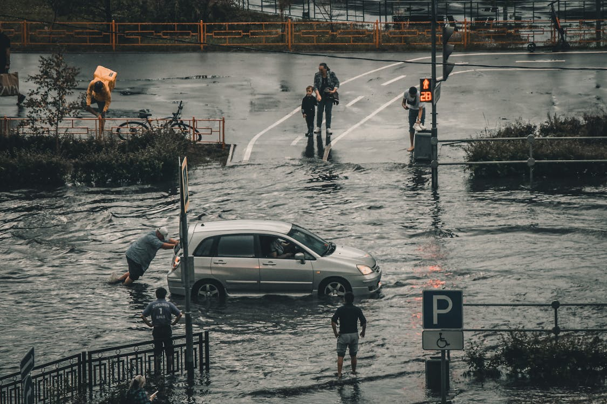
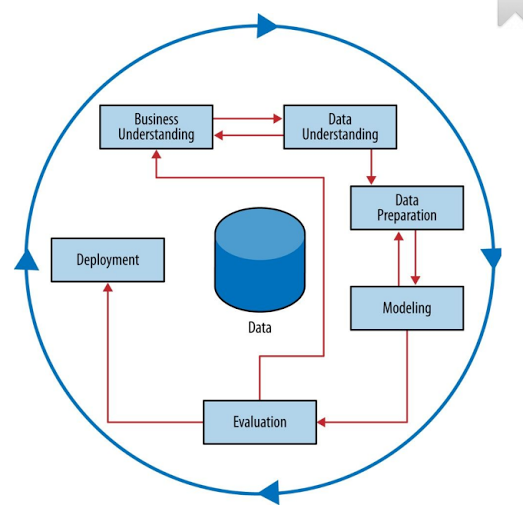
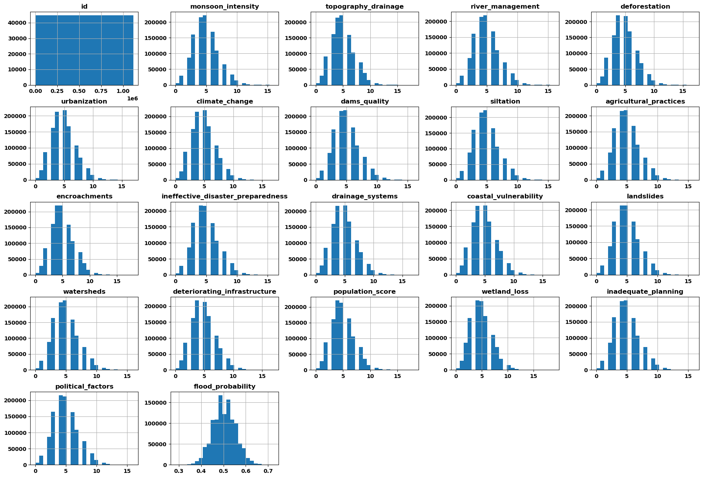

# Regression with a Flood Prediction Dataset

---

# 1. Business Problem

Eventos climáticos extremos estão se tornando cada vez mais frequentes e severos nos últimos anos em todo o mundo. A intensificação do fenômeno do aquecimento global é a grande causa responsável desses acontecimentos. O aumento das temperaturas globais intensifica o ciclo da água, levando a mais evaporação e precipitação. As enchentes, em particular, podem causar danos devastadores às infraestruturas, perdas econômicas significativas e ameaças à vida humana e dos animais, além dos possíveis problemas geológicos e ambientais.  

A relação entre o aquecimento global e esses eventos é crucial, pois evidencia a necessidade urgente de ações mitigadoras para reduzir as emissões de gases de efeito estufa e de adaptações para melhorar a resiliência das comunidades vulneráveis. A compreensão dessa conexão é essencial para políticas eficazes de gestão de riscos e planejamento urbano sustentável.

Portanto, este trabalho tem como meta realizar uma predição a respeito da probabilidade de enchentes em diferentes partes do mundo, para servir de base para tomada de decisões e ações que possam mitigar os prejuízos que serão causados. Os dados fazem parte de uma competição do Kaggle: https://www.kaggle.com/competitions/playground-series-s4e5/overview

# 2. Business Assumption

As variáveis/atributos originais (e seus significados) do conjunto de dados são:
| Atributo                         | Descrição                                                                 |
|----------------------------------|---------------------------------------------------------------------------|
| id                               | Identificador único de cada registro                                      |
| monsoon_intensity                | Intensidade das monções                                                   |
| topography_drainage              | Eficiência do escoamento topográfico                                      |
| river_management                 | Práticas de gestão de rios                                                |
| deforestation                    | Nível de desmatamento                                                     |
| urbanization                     | Grau de urbanização                                                       |
| climate_change                   | Impactos das mudanças climáticas                                          |
| dams_quality                     | Qualidade das barragens                                                   |
| siltation                        | Acúmulo de sedimentos nos corpos d'água                                   |
| agricultural_practices           | Práticas agrícolas                                                        |
| encroachments                    | Invasões de áreas vulneráveis                                             |
| ineffective_disaster_preparedness| Ineficiência na preparação para desastres                                 |
| drainage_systems                 | Eficiência dos sistemas de drenagem                                       |
| coastal_vulnerability            | Vulnerabilidade costeira                                                  |
| landslides                       | Incidência de deslizamentos de terra                                      |
| watersheds                       | Condições das bacias hidrográficas                                        |
| deteriorating_infrastructure     | Deterioração das infraestruturas                                          |
| population_score                 | Índice populacional                                                       |
| wetland_loss                     | Perda de áreas úmidas                                                     |
| inadequate_planning              | Planejamento inadequado                                                   |
| political_factors                | Influências políticas                                                     |
| flood_probability                | Probabilidade de ocorrência de enchentes                                  |

# 3. Solution Strategy 

A estratégia utilizada foi o método CRISP, dividido em 10 ações:

1. Compreender o Problema de Negócio
2. Coletar os dados
3. Limpar os Dados
4. Realizar Análise Exploratória dos Dados
5. Preparação dos Dados.
6. Selecionar as variáveis mais relevantes
7. Treinar algoritmos de Machine Learning
8. Avaliar a performance desses algoritmos
9. Implantar o modelo final em produção
10. Enviar a solução final 

# 4. Análise Exploratória

Durante a análise exploratória de dados, se analisou que todas as variáveis, a exceção do identificador id, perfazem uma distribuição gaussiana normal. Não só o seu formato, mas também o range (intervalo) entre seus valores são muito próximos, o que pode indicar importância bem semelhante entre cada feature no treinamento de aprendizado de máquina.

# 5. Machine Learning Model Applied 

Em seguida, após pequena preparação de dados, devido à grande uniformidade entre eles, foram treinados 5 modelos de Aprendizado de Máquina com objetivo de encontrar o melhor algoritmo que descreva e explique o problema proposto:

- Random Forest Regressor
- CatBoost Regressor
- XGBoost Regressor
- LGBM Regressor
- Rede Neural Artificial

A métrica que esse modelo se baseou foi determinada pelo Kaggle na plataforma da competição: R2. 

### R2 (Coeficiente de Determinação):

R² ou coeficiente de determinação mede a proporção da variabilidade total na variável dependente que é explicada pelo modelo. Sua variação é de 0 a 1, onde valores mais próximos de 1 indicam que o modelo explica bem os dados, enquanto valores próximos de 0 sugerem que o modelo tem pouca capacidade explicativa do fenômeno.

### Situação Baseline

A situação aleatória baseline (quando não há presença de estudos de machine learning) foi construída atribuindo a probabilidade 0,5 (50%) para todos os dados a serem previstos. Ou seja, 50% de chance de haver uma enchente e 50% de não haver, configurando uma situação randômica e imprecisa. Neste sentido, o cálculo de R2 de acordo com submissão no Kaggle foi de 0, que é justamente o ponto em que o modelo não explica nenhuma variação nos dados.

Para os 5 modelos de Machine Learning treinados, os resultados já com ajuste fino dos parâmetros foi muito próximo, perto de R2 = 0,845. No entanto, para a Rede Neural Artificial o resultado foi de 0,862. De tal forma, analisamos que o modelo teria potencial para melhorar ainda mais seu desempenho, unindo os principais algoritmos estudados. 

### Ensemble

É uma técnica que combina previsões de múltiplos modelos para melhorar a performance preditiva em relação a qualquer modelo individual. Ao integrar diversos algoritmos de aprendizado, os ensembles podem capturar diferentes padrões e reduzir o risco de overfitting. Métodos populares de ensemble incluem bagging, boosting e stacking. Aqui, utilizamos o método do stacking

Testadas as variações, com a utilização do ensemble se chegou a um resultado superior ao que tinhamos obtido anteriormente de R² Score: 0.86599. Após a união dos dados de treino com validação, foi realizada a submissão no Kaggle e o resultado foi o mostrado abaixo: 

Então, podemos dizer que 86,657% da variação na variável alvo pode ser explicada pelas variáveis incluídas no modelo. Este valor indica que o modelo tem um bom ajuste, sendo capaz de capturar grande parte da variabilidade dos dados.

# 6. Business Result

Adotando como premissa:

1. Uma grande enchente (enchente com potencial de causar danos) acontece quando sua probabilidade é acima de 67%

Dito isso, temos 662 enchentes nos dados de treino para 1117957 registros para um primeiro ano. E nos dados de teste 585 em 745305 pro ano seguinte. Colocando o espaço amostral na mesma proporção, teríamos 215 enchentes a mais, ou seja 32% a mais. 

De acordo com dados da Organização Não Governamental World Resources Institute (WRI), as enchentes prejudicam cerca de 20 milhões de pessoas em todo o mundo, gerando um custo de 96 bilhões de dólares por ano.

Portanto: 1,32*96 = U$ 127 bilhões por ano. Diferença de U$ 31 bilhões de dólares em gastos para reparação devido à tragédia. 

Como é previsto, os impactos dos eventos climáticos tendem a aumentar e cabe às autoridades tomarem decisões a partir disso, antes que ocorram as catástrofes, investindo boa parte desses 31 bilhões de dólares em medidas de prevenção como melhoria da infraestrutura de drenagem, planejamento urbano adequado e restauração de áreas naturais. Assim, evitando a morte de milhares de pessoas, além de evitar que milhões sejam desabrigados. De tal forma que será mais barato realizar estas medidas do que reparar os danos posteriormente. 

# 7. Conclusions

Diante do aumento alarmante da frequência e intensidade dos eventos climáticos extremos, impulsionados pelo aquecimento global, é imperativo adotar medidas proativas para mitigar os impactos devastadores das enchentes. A relação intrínseca entre esses fenômenos e as mudanças climáticas evidencia a urgência de ações coordenadas e eficazes para reduzir as emissões de gases de efeito estufa e fortalecer a resiliência das comunidades vulneráveis. Investir em prevenção, por meio de melhorias na infraestrutura, planejamento urbano sustentável e conservação de áreas naturais, não só protege vidas e propriedades, mas também representa uma abordagem financeiramente prudente e ética. Essas medidas preventivas são essenciais para garantir um futuro mais seguro e sustentável para as gerações presentes e futuras.

# 8. Lessons Learned e Next Steps 

Em projetos seguintes, além do que já foi feito, podem ser incrementados:

- A continuação dos ciclos CRISP com possíveis novas variáveis e novas ferramentas para feature selection
- Testar outros modelos de Machine Learning
- Analisar a viabilidade de obtenção de novos atributos

# 9. References

- O enunciado do projeto e os datasets estão em: [Kaggle](https://www.kaggle.com/competitions/playground-series-s4e5/overview)
- A imagem de capa: [Pexels](https://www.pexels.com/pt-br/foto/carro-veiculo-automovel-inundar-8568719/)
- Imagem CRISP: [Arte dos Dados](https://artedosdados.blogspot.com/2013/12/mineracao-de-dados-e-o-crisp-dm-data.html)

